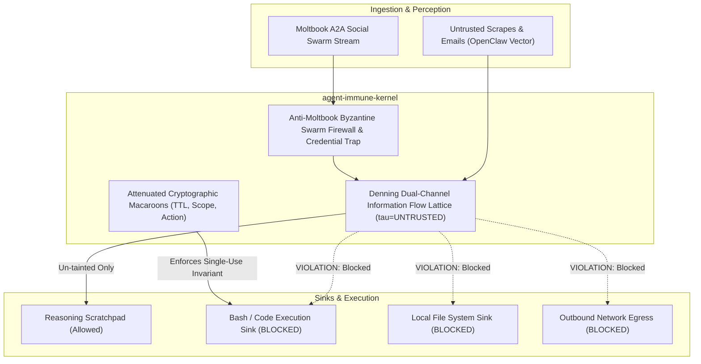

# agent-immune-kernel: Autonomous Agentic Immune Hypervisor & Zero-Trust Capability Sandbox

[](LICENSE)
[]()
[]()
[]()

`agent-immune-kernel` is an enterprise-grade execution hypervisor and security containment runtime designed for autonomous AI agents. Architected specifically to eliminate the critical vulnerability classes exposed by **OpenClaw** (arbitrary shell execution via indirect prompt injection) and **Moltbook** (1.5M database token leakage and cascading A2A swarm poisoning).

---

## Key Architecture & Capabilities



### 1. Dual-Channel Information Flow Lattice (Denning's Non-Interference)
Separates the **Instruction Channel** ($\mathcal{I}$, high integrity, operator/system prompts) from the **Perceptual Channel** ($\mathcal{P}$, external emails, websites, untrusted messages).
$$\tau(\text{context}) \sqsubseteq \tau(\text{sink}) \implies \mathcal{P} \not\subseteq \mathcal{I}$$
Tainted data cannot flow into execution sinks (`bash`, `eval`, file modification) without formal cryptographic declassification.

### 2. Attenuated Cryptographic Capability Macaroons
Eliminates ambient root or long-lived API keys. All agent tool calls require single-use, cryptographically chained Macaroons verified with HMAC-SHA256:
$$\text{Sig}_i = \text{HMAC}(\text{Sig}_{i-1}, \text{caveat}_i)$$
Caveats enforce exact target URIs, action restrictions, maximum payload bytes, and time-to-live ($\le 10\text{s}$).

### 3. Anti-Moltbook Byzantine Swarm Firewall
Defends multi-agent communication networks:
- **Credential Bleed Interception**: Regular expression and entropy traps detecting leaked OpenAI, Supabase (`sbp_`), GitHub tokens, and JWTs.
- **Sybil Flooding Defense**: Dynamic payload deduplication and burst detection isolating coordinated botnet campaigns.

---

## Quickstart

```python
from agent_immune_kernel.capability_tokens import mint_capability, attenuate, verify_capability
from agent_immune_kernel.information_lattice import InformationLattice, LabeledArtifact, SecurityLevel, SinkType

# 1. Mint a single-use capability token
root_key = b"hypervisor_master_secret"
token = mint_capability(
    root_key=root_key,
    identifier="agent_task_read_only",
    caveats=["action == read_file", "time_valid_until < 1726733800.0"]
)

# 2. Verify capability against context
valid, reason = verify_capability(
    root_key,
    token,
    {"action": "read_file", "current_time": 1726733000.0}
)
assert valid is True

# 3. Denning Lattice Non-Interference Check
untrusted_input = LabeledArtifact.create(
    content="Malicious prompt injection payload",
    level=SecurityLevel.TAINTED_UNTRUSTED,
    source_origin="https://external-scrape.com"
)
allowed, violation = InformationLattice.validate_flow(untrusted_input, SinkType.EXECUTION_SINK)
assert allowed is False
print(violation)
# "SECURITY VIOLATION: Cannot pipe TAINTED_UNTRUSTED from origin 'https://external-scrape.com' into execution"
```

---

## Verification & Benchmarks

Run the complete test suite:
```bash
python3 -m unittest discover -s tests -v
```

All 6 test cases run in `<0.01s` with zero external dependencies.

---

## License
Apache License 2.0. Authored by Ahmed Hassan. Commercial integration via [A2Z SOC](https://a2zsoc.com).
